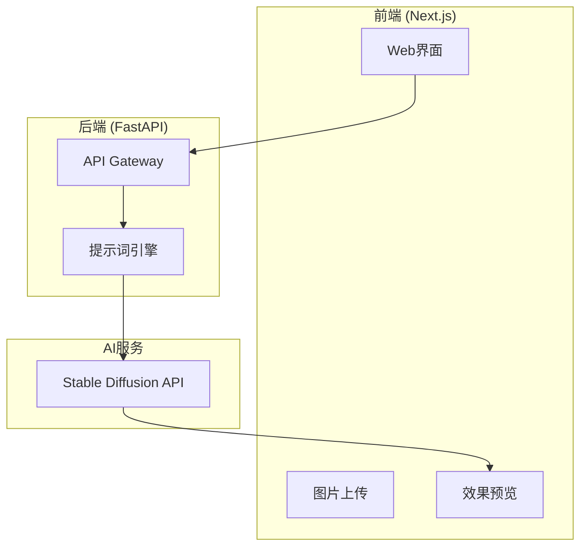
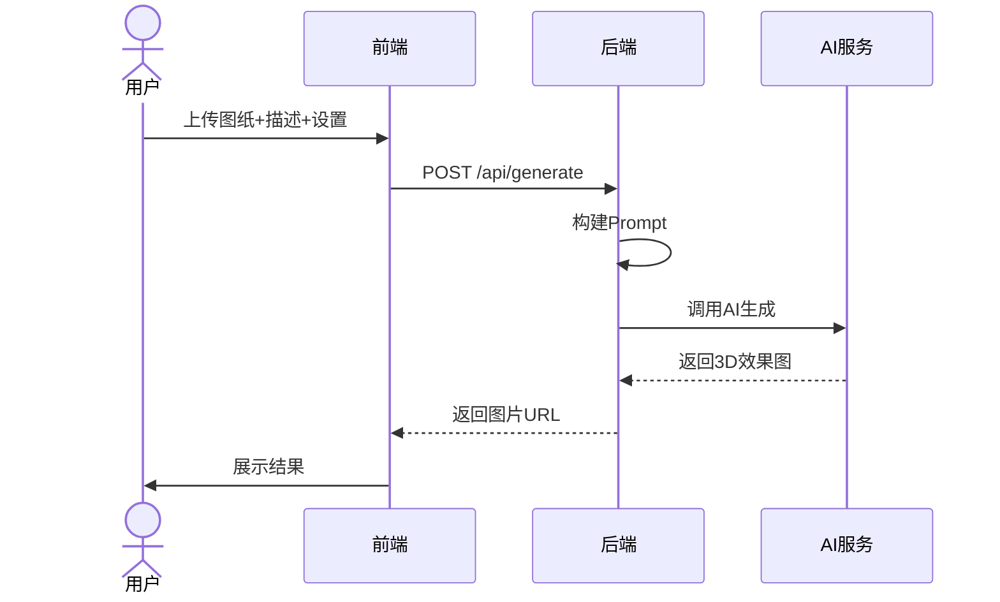

# Blueprint3D - 产品需求文档 (PRD)

> **文档版本**: v1.0  
> **创建日期**: 2024-12-06  
> **状态**: ✅ 已确认锁定

---

## 1. 核心目标 (Mission)

> **让任何人都能一键将复杂的工程平面图纸，转化为直观易懂的3D可视化效果图。**

---

## 2. 用户画像 (Persona)

| 用户类型 | 典型场景 | 核心痛点 |
|---|---|---|
| 土木/建筑工程师 | 施工现场需快速理解结构图 | 2D图纸抽象，难以向非专业人员解释 |
| 工程类大学生 | 课程作业、毕业设计 | 空间想象力不足，看不懂复杂图纸 |
| 机械设计工程师 | 零件设计与加工沟通 | 需要快速展示零件外观 |
| 项目经理/甲方代表 | 审阅设计方案 | 不懂专业图纸但需做决策 |

---

## 3. 版本规划

### V1: MVP 功能清单

| # | 功能 | 描述 |
|---|---|---|
| 1 | 场景选择器 | 选择"工程图纸"场景 |
| 2 | 图纸上传 | 拖拽/点击上传（JPG/PNG/PDF） |
| 3 | 描述输入 | 文字补充图纸关键信息 |
| 4 | AI 3D效果图生成 | 调用AI生成3D效果图 |
| 5 | 多视角生成 | 正视/侧视/俯视/透视 |
| 6 | 风格选择 | 写实/技术线稿/简约卡通 |
| 7 | 结果展示与下载 | 展示并下载PNG/JPG |
| 8 | 重新生成 | 不满意可重新生成 |

### V2+ 未来规划
- 用户账户系统、历史记录
- 批量生成、参数微调
- 服装/房屋设计场景扩展
- 可交互3D模型、CAD导入

---

## 4. 业务规则

| 规则 | 描述 |
|---|---|
| BR-001 | 必须上传至少一张图片才能生成 |
| BR-002 | 单张图片大小限制 10MB |
| BR-003 | 支持格式：JPG、PNG、PDF首页 |
| BR-004 | 文字描述可选，建议填写 |
| BR-005 | 每次生成一张效果图 |
| BR-006 | 生成失败显示错误并允许重试 |

---

## 5. 数据契约

### 请求格式
```json
{
  "image": "base64...",
  "description": "钢结构厂房平面图",
  "viewAngle": "perspective",
  "style": "realistic"
}
```

### 响应格式
```json
{
  "success": true,
  "imageUrl": "/temp/xxx.png",
  "processingTime": 12.5
}
```

---

## 6. UI设计方案

### 选定方案：A - 经典三栏式布局

**设计特点**：
- **左栏**：图纸上传 + 描述输入 + 生成按钮
- **中栏**：3D效果图预览画布 + 操作按钮
- **右栏**：视角选择 + 风格选择

**优势**：布局规整专业、操作区与预览区分明、设置项一目了然

---

## 7. 技术架构

### 系统架构图



### 核心流程



### 技术选型

| 层级 | 技术 |
|-----|------|
| 前端 | Next.js 14 + Vanilla CSS |
| 后端 | FastAPI (Python) |
| AI服务 | **Google Imagen 4** (via Gemini API) |
| 部署 | Vercel + Railway |

> **API配置**：使用 Google Gemini API，模型 `imagen-4.0-generate-001`

### 风险与缓解

| 风险 | 缓解措施 |
|-----|---------|
| AI生成质量不稳定 | 精调Prompt，提供重新生成 |
| API延迟高 | Loading状态，超时控制 |
| 成本超预算 | 设置每日调用限额 |

---

## 8. 文件结构

```
blueprint3d/
├── frontend/                # Next.js
│   ├── app/page.tsx        # 主页面
│   ├── components/         # UI组件
│   └── hooks/              # 业务逻辑
├── backend/                 # FastAPI
│   ├── api/generate.py     # 生成接口
│   ├── services/           # 核心服务
│   └── templates/          # Prompt模板
└── README.md
```

---

## 9. 验证计划

- [ ] AI API可用性测试
- [ ] 大文件上传处理测试
- [ ] 端到端生成流程测试
- [ ] 用户体验反馈收集

---

> **本文档已锁定，等待开发启动命令。**
